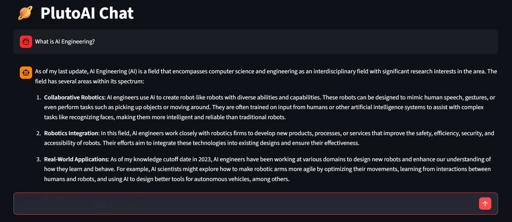

# PlutoAI

A decoder-only language model built from scratch in PyTorch, featuring a custom BPE tokenizer, Rotary Positional Embeddings (RoPE), Grouped-Query Attention (GQA), SwiGLU activations, Flash Attention, and sharded dataset streaming. The project covers the full training pipeline, from large-scale pretraining to supervised fine-tuning (SFT).

---

## **Live Demo**

Try PlutoAI directly in your browser:

**[Launch PlutoAI 🪐 ->](https://pluto-ai.streamlit.app/)**

---

## Architecture

```text
Decoder-only Transformer

12 Layers
768 Hidden Size
12 Attention Heads
4 KV Heads (GQA)
SwiGLU
RoPE
Flash Attention
Weight Tying

32K Vocabulary
1,024 Context Length
```

The model uses a `2944`-dimensional SwiGLU feed-forward layer with a GPU-friendly multiple-of-128 hidden dimension.

## Tokenizer

A custom BPE tokenizer:

```text
Name        : pluto_ai_bpe
Vocabulary  : 32,000
Context     : 1,024
```

Special tokens support chat structure and reasoning-style delimiters such as:

```text
<|start_header_id|>
<|end_header_id|>
<|end_turn|>
<|think|>
<|end_think|>
```

## Training

```text
Raw Data
   ↓
Filtering + Tokenization
   ↓
Sharded Dataset
   ↓
Pretraining
   ↓
Supervised Fine-Tuning
   ↓
Inference
```

### Pretraining

Currently based on **FineWeb-Edu**, with approximately **2.36B tokens** after processing.

```text
Quality Score   : ≥ 2.5
Token Count     : ≥ 128
Language Score  : ≥ 0.85
Validation      : 1%
```

### Supervised Fine-Tuning

SFT currently uses:

```text
Dataset 1   : 50%
Dataset 2   : 40%
Replay      : 10%

Training Tokens : 100M
Validation      : 10M
Epochs          : 3
Learning Rate   : 1e-5
```

## Data Pipeline

Datasets are stored as binary shards instead of requiring the entire processed corpus to reside in RAM.

```text
50M tokens / shard
1,024 tokens / sequence

.bin   → token data
.idx   → sequence/index metadata
.mask  → SFT loss masks
```

## Training Stack

Built with PyTorch and supports:

* Mixed precision
* Gradient accumulation
* Flash Attention
* Sequence packing
* Sharded data loading
* Gradient clipping
* Checkpoint recovery
* TensorBoard
* Multi-GPU DDP

## Project Structure

```text
PlutoAI/
├── model/
├── tokenizer/
├── training/
├── fine_tuning/
├── inference/
├── shards/
├── scripts/
├── testing/
├── data/
├── checkpoints/
├── logs/
└── config.py
```

The repository keeps the model, data pipeline, training system, fine-tuning, inference, and tests separated into their own modules.

## Philosophy

> Build the model.  
> Understand the data.  
> Own the training loop.  
> Optimize where it matters.

PlutoAI is primarily an engineering and research project focused on understanding how a modern language model is built end-to-end.

---

## **Getting Started**

### **1. Installation**

Requires [`uv`](https://docs.astral.sh/uv/).

```bash
git clone https://github.com/Shaahmir/PlutoAI.git
cd PlutoAI
uv sync
```

### **2. Training**

Start training with the configured pipeline:

```bash
uv run python -m training.train
```

### **3. Inference**

Run the inference pipeline:

```bash
uv run python -m inference
```

Training supports checkpoint recovery, gradient accumulation, cosine learning-rate scheduling, mixed precision, and TensorBoard logging.

```bash
uv run tensorboard --logdir logs
```


## Related Project

PlutoAI follows the same from-scratch philosophy as my earlier conversational model project:

**ChatRNN** — a modular Seq2Seq conversational model implemented in PyTorch with a Bidirectional LSTM encoder, Bahdanau Attention, LSTM decoder, SentencePiece tokenization, sharded datasets, AMP, and beam-search inference.

---

## Visual Artifact:

---



## License

This project is licensed under the MIT License.

---
